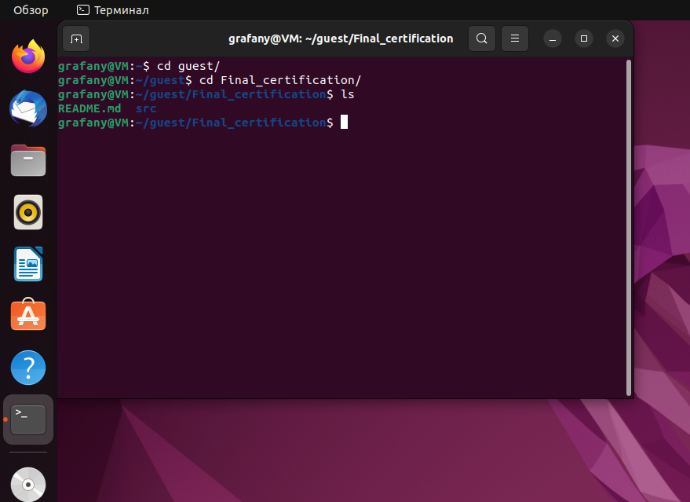
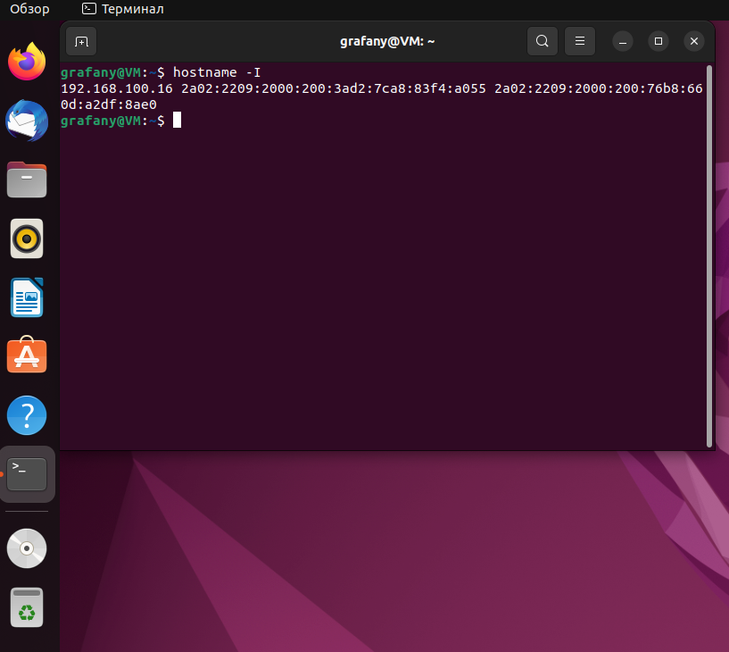
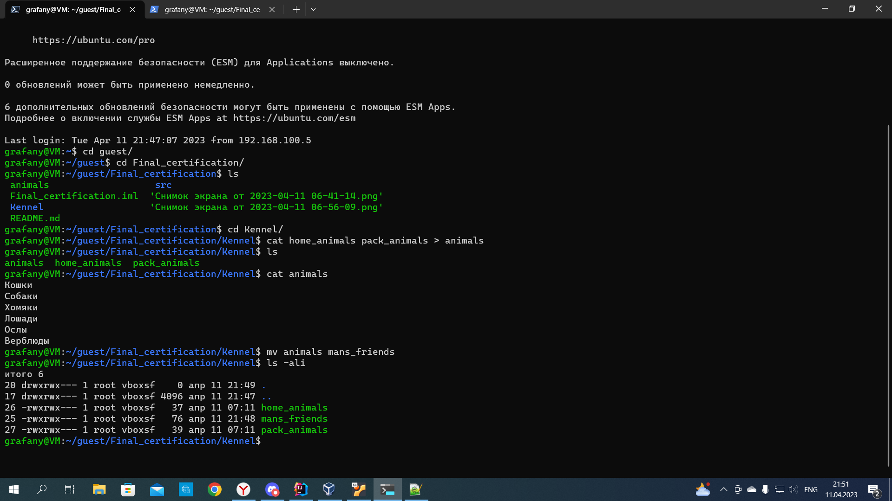
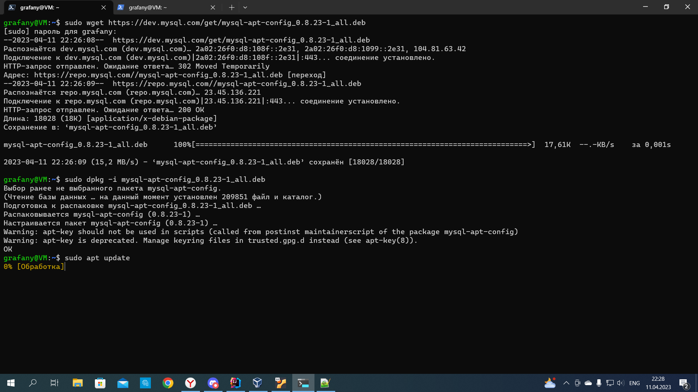
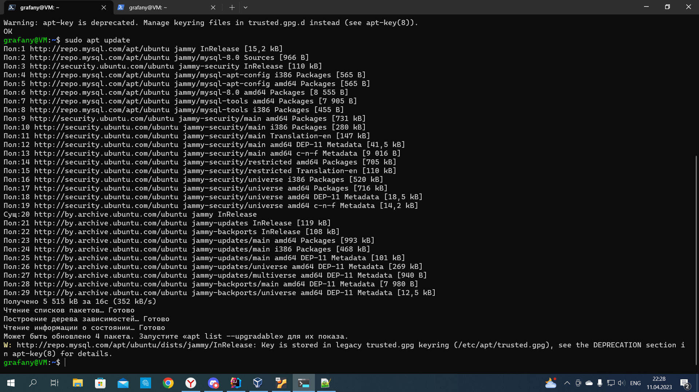
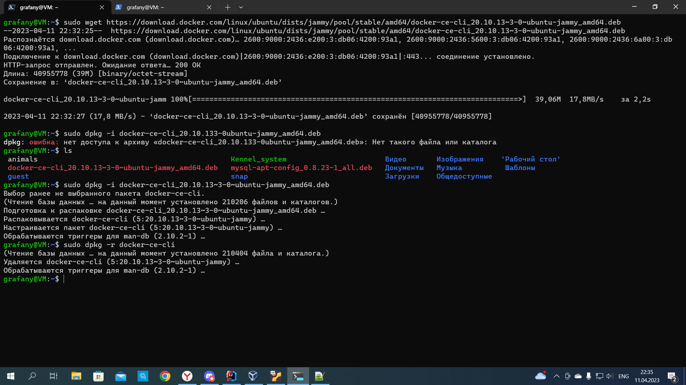

# linux terminal commands

### Скрин терминала









```shell
grafany@VM:~$ hostname -I
192.168.100.16  
grafany@VM:~$ cd guest/
grafany@VM:~/guest$ ls
Final_certification
grafany@VM:~/guest$ cd Final_certification/
grafany@VM:~/guest/Final_certification$ ll
итого 449
drwxrwx--- 1 root vboxsf   4096 кра 11 06:56  ./
drwxrwx--- 1 root vboxsf      0 кра 10 23:44  ../
-rwxrwx--- 1 root vboxsf    433 кра 11 00:47  Final_certification.iml*
drwxrwx--- 1 root vboxsf   4096 кра 11 06:47  .git/
-rwxrwx--- 1 root vboxsf    344 кра 10 23:44  .gitignore*
drwxrwx--- 1 root vboxsf      0 кра 11 06:47  .idea/
-rwxrwx--- 1 root vboxsf   6194 кра 11 00:12  README.md*
drwxrwx--- 1 root vboxsf      0 кра 10 23:44  src/
-rwxrwx--- 1 root vboxsf 211387 кра 11 06:41 'Снимок экрана от 2023-04-11 06-41-14.png'*
-rwxrwx--- 1 root vboxsf 228279 кра 11 06:56 'Снимок экрана от 2023-04-11 06-56-09.png'*
grafany@VM:~/guest/Final_certification$ mkdir Kennel
grafany@VM:~/guest/Final_certification$ ls
 Final_certification.iml   src
 Kennel                   'Снимок экрана от 2023-04-11 06-41-14.png'
 README.md                'Снимок экрана от 2023-04-11 06-56-09.png'
grafany@VM:~/guest/Final_certification$ 
grafany@VM:~/guest/Final_certification$ 
grafany@VM:~/guest/Final_certification$ cd ~/Kennel
bash: cd: /home/grafany/Kennel: Нет такого файла или каталога
grafany@VM:~/guest/Final_certification$ cd Kennel/
grafany@VM:~/guest/Final_certification/Kennel$ cat > home_animals
Кошки
Собаки
Хомяки
grafany@VM:~/guest/Final_certification/Kennel$ cat > pack_animals
Лошади
Ослы
Верблюды
grafany@VM:~/guest/Final_certification/Kennel$ cat  pack_animals
Лошади
Ослы
Верблюды
grafany@VM:~/guest/Final_certification/Kennel$ cat  home_animals
Кошки
Собаки
Хомяки
grafany@VM:~$ cd guest/
grafany@VM:~/guest$ cd Final_certification/
grafany@VM:~/guest/Final_certification$ ls
 animals                   src
 Final_certification.iml  'Снимок экрана от 2023-04-11 06-41-14.png'
 Kennel                   'Снимок экрана от 2023-04-11 06-56-09.png'
 README.md
grafany@VM:~/guest/Final_certification$ cd Kennel/
grafany@VM:~/guest/Final_certification/Kennel$ cat home_animals pack_animals > animals
grafany@VM:~/guest/Final_certification/Kennel$ ls
animals  home_animals  pack_animals
grafany@VM:~/guest/Final_certification/Kennel$ cat animals
Кошки
Собаки
Хомяки
Лошади
Ослы
Верблюды
grafany@VM:~/guest/Final_certification/Kennel$ mv animals mans_friends
grafany@VM:~/guest/Final_certification/Kennel$ ls -ali
итого 6
20 drwxrwx--- 1 root vboxsf    0 апр 11 21:49 .
17 drwxrwx--- 1 root vboxsf 4096 апр 11 21:47 ..
26 -rwxrwx--- 1 root vboxsf   37 апр 11 07:11 home_animals
25 -rwxrwx--- 1 root vboxsf   76 апр 11 21:48 mans_friends
27 -rwxrwx--- 1 root vboxsf   39 апр 11 07:11 pack_animals
grafany@VM:~/guest/Final_certification/Kennel$ cd ..
grafany@VM:~/guest/Final_certification$ mkdir Kennel_system
grafany@VM:~/guest/Final_certification$ cd Kennel
grafany@VM:~/guest/Final_certification/Kennel$ ll
итого 5
drwxrwx--- 1 root vboxsf    0 апр 11 22:16 ./
drwxrwx--- 1 root vboxsf 4096 апр 11 22:16 ../
-rwxrwx--- 1 root vboxsf    0 апр 11 21:47 animals*
-rwxrwx--- 1 root vboxsf   37 апр 11 07:11 home_animals*
-rwxrwx--- 1 root vboxsf   39 апр 11 07:11 pack_animals*
grafany@VM:~/guest/Final_certification/Kennel$ mv animals mans_friends
grafany@VM:~/guest/Final_certification/Kennel$ mv mans_friends ../Kennel_system
grafany@VM:~/guest/Final_certification/Kennel$ cd ../Kennel_system
grafany@VM:~/guest/Final_certification/Kennel_system$ ll
итого 4
drwxrwx--- 1 root vboxsf    0 апр 11 22:18 ./
drwxrwx--- 1 root vboxsf 4096 апр 11 22:16 ../
-rwxrwx--- 1 root vboxsf    0 апр 11 21:47 mans_friends*
grafany@VM:~/guest/Final_certification/Kennel_system$ cd /home/grafany
grafany@VM:~$ sudo wget https://dev.mysql.com/get/mysql-apt-config_0.8.23-1_all.deb
[sudo] пароль для grafany:
--2023-04-11 22:26:08--  https://dev.mysql.com/get/mysql-apt-config_0.8.23-1_all.deb
Распознаётся dev.mysql.com (dev.mysql.com)… 2a02:26f0:d8:108f::2e31, 2a02:26f0:d8:1099::2e31, 104.81.63.42
Подключение к dev.mysql.com (dev.mysql.com)|2a02:26f0:d8:108f::2e31|:443... соединение установлено.
HTTP-запрос отправлен. Ожидание ответа… 302 Moved Temporarily
Адрес: https://repo.mysql.com//mysql-apt-config_0.8.23-1_all.deb [переход]
--2023-04-11 22:26:09--  https://repo.mysql.com//mysql-apt-config_0.8.23-1_all.deb
Распознаётся repo.mysql.com (repo.mysql.com)… 23.45.136.221
Подключение к repo.mysql.com (repo.mysql.com)|23.45.136.221|:443... соединение установлено.
HTTP-запрос отправлен. Ожидание ответа… 200 OK
Длина: 18028 (18K) [application/x-debian-package]
Сохранение в: ‘mysql-apt-config_0.8.23-1_all.deb’

mysql-apt-config_0.8.23-1_all.deb      100%[============================================================================>]  17,61K  --.-KB/s    за 0,001s

2023-04-11 22:26:09 (15,2 MB/s) - ‘mysql-apt-config_0.8.23-1_all.deb’ сохранён [18028/18028]

grafany@VM:~$ sudo dpkg -i mysql-apt-config_0.8.23-1_all.deb
Выбор ранее не выбранного пакета mysql-apt-config.
(Чтение базы данных … на данный момент установлен 209851 файл и каталог.)
Подготовка к распаковке mysql-apt-config_0.8.23-1_all.deb …
Распаковывается mysql-apt-config (0.8.23-1) …
Настраивается пакет mysql-apt-config (0.8.23-1) …
Warning: apt-key should not be used in scripts (called from postinst maintainerscript of the package mysql-apt-config)
Warning: apt-key is deprecated. Manage keyring files in trusted.gpg.d instead (see apt-key(8)).
OK
grafany@VM:~$ sudo apt update
Пол:1 http://repo.mysql.com/apt/ubuntu jammy InRelease [15,2 kB]
Пол:2 http://repo.mysql.com/apt/ubuntu jammy/mysql-8.0 Sources [966 B]
Пол:3 http://security.ubuntu.com/ubuntu jammy-security InRelease [110 kB]
Пол:4 http://repo.mysql.com/apt/ubuntu jammy/mysql-apt-config i386 Packages [565 B]
Пол:5 http://repo.mysql.com/apt/ubuntu jammy/mysql-apt-config amd64 Packages [565 B]
Пол:6 http://repo.mysql.com/apt/ubuntu jammy/mysql-8.0 amd64 Packages [8 555 B]
Пол:7 http://repo.mysql.com/apt/ubuntu jammy/mysql-tools amd64 Packages [7 905 B]
Пол:8 http://repo.mysql.com/apt/ubuntu jammy/mysql-tools i386 Packages [455 B]
Пол:9 http://security.ubuntu.com/ubuntu jammy-security/main amd64 Packages [731 kB]
Пол:10 http://security.ubuntu.com/ubuntu jammy-security/main i386 Packages [280 kB]
Пол:11 http://security.ubuntu.com/ubuntu jammy-security/main Translation-en [147 kB]
Пол:12 http://security.ubuntu.com/ubuntu jammy-security/main amd64 DEP-11 Metadata [41,5 kB]
Пол:13 http://security.ubuntu.com/ubuntu jammy-security/main amd64 c-n-f Metadata [9 016 B]
Пол:14 http://security.ubuntu.com/ubuntu jammy-security/restricted amd64 Packages [705 kB]
Пол:15 http://security.ubuntu.com/ubuntu jammy-security/restricted Translation-en [110 kB]
Пол:16 http://security.ubuntu.com/ubuntu jammy-security/universe i386 Packages [520 kB]
Пол:17 http://security.ubuntu.com/ubuntu jammy-security/universe amd64 Packages [716 kB]
Пол:18 http://security.ubuntu.com/ubuntu jammy-security/universe amd64 DEP-11 Metadata [18,5 kB]
Пол:19 http://security.ubuntu.com/ubuntu jammy-security/universe amd64 c-n-f Metadata [14,2 kB]
Сущ:20 http://by.archive.ubuntu.com/ubuntu jammy InRelease
Пол:21 http://by.archive.ubuntu.com/ubuntu jammy-updates InRelease [119 kB]
Пол:22 http://by.archive.ubuntu.com/ubuntu jammy-backports InRelease [108 kB]
Пол:23 http://by.archive.ubuntu.com/ubuntu jammy-updates/main amd64 Packages [993 kB]
Пол:24 http://by.archive.ubuntu.com/ubuntu jammy-updates/main i386 Packages [468 kB]
Пол:25 http://by.archive.ubuntu.com/ubuntu jammy-updates/main amd64 DEP-11 Metadata [101 kB]
Пол:26 http://by.archive.ubuntu.com/ubuntu jammy-updates/universe amd64 DEP-11 Metadata [269 kB]
Пол:27 http://by.archive.ubuntu.com/ubuntu jammy-updates/multiverse amd64 DEP-11 Metadata [940 B]
Пол:28 http://by.archive.ubuntu.com/ubuntu jammy-backports/main amd64 DEP-11 Metadata [7 980 B]
Пол:29 http://by.archive.ubuntu.com/ubuntu jammy-backports/universe amd64 DEP-11 Metadata [12,5 kB]
Получено 5 515 kB за 16с (352 kB/s)
Чтение списков пакетов… Готово
Построение дерева зависимостей… Готово
Чтение информации о состоянии… Готово
Может быть обновлено 4 пакета. Запустите «apt list --upgradable» для их показа.
W: http://repo.mysql.com/apt/ubuntu/dists/jammy/InRelease: Key is stored in legacy trusted.gpg keyring (/etc/apt/trusted.gpg), see the DEPRECATION section in apt-key(8) for details.
grafany@VM:~$ sudo apt-get install mysql-server
Чтение списков пакетов… Готово
Построение дерева зависимостей… Готово
Чтение информации о состоянии… Готово
Следующий пакет устанавливался автоматически и больше не требуется:
  chromium-codecs-ffmpeg-extra gstreamer1.0-vaapi i965-va-driver intel-media-va-driver libaacs0 libaom3 libass9 libavcodec58 libavformat58 libavutil56
  libbdplus0 libblas3 libbluray2 libbs2b0 libchromaprint1 libcodec2-1.0 libdav1d5 libflashrom1 libflite1 libftdi1-2 libgme0 libgsm1
  libgstreamer-plugins-bad1.0-0 libigdgmm12 liblilv-0-0 libllvm13 libmfx1 libmysofa1 libnorm1 libopenmpt0 libpgm-5.3-0 libpostproc55 librabbitmq4
  librubberband2 libserd-0-0 libshine3 libsnappy1v5 libsord-0-0 libsratom-0-0 libsrt1.4-gnutls libssh-gcrypt-4 libswresample3 libswscale5 libudfread0
  libva-drm2 libva-wayland2 libva-x11-2 libva2 libvdpau1 libvidstab1.1 libx265-199 libxvidcore4 libzimg2 libzmq5 libzvbi-common libzvbi0 mesa-va-drivers
  mesa-vdpau-drivers pocketsphinx-en-us va-driver-all vdpau-driver-all
Для его удаления используйте «sudo apt autoremove».
Будут установлены следующие дополнительные пакеты:
  libaio1 libmecab2 mecab-ipadic mecab-ipadic-utf8 mecab-utils mysql-client mysql-common mysql-community-client mysql-community-client-core
  mysql-community-client-plugins mysql-community-server mysql-community-server-core
Следующие НОВЫЕ пакеты будут установлены:
  libaio1 libmecab2 mecab-ipadic mecab-ipadic-utf8 mecab-utils mysql-client mysql-common mysql-community-client mysql-community-client-core
  mysql-community-client-plugins mysql-community-server mysql-community-server-core mysql-server
Обновлено 0 пакетов, установлено 13 новых пакетов, для удаления отмечено 0 пакетов, и 4 пакетов не обновлено.
Необходимо скачать 38,3 MB архивов.
После данной операции объём занятого дискового пространства возрастёт на 273 MB.
Хотите продолжить? [Д/н] y
Пол:1 http://by.archive.ubuntu.com/ubuntu jammy/main amd64 libaio1 amd64 0.3.112-13build1 [7 176 B]
Пол:2 http://by.archive.ubuntu.com/ubuntu jammy/main amd64 libmecab2 amd64 0.996-14build9 [199 kB]
Пол:3 http://by.archive.ubuntu.com/ubuntu jammy/main amd64 mecab-utils amd64 0.996-14build9 [4 850 B]
Пол:4 http://by.archive.ubuntu.com/ubuntu jammy/main amd64 mecab-ipadic all 2.7.0-20070801+main-3 [6 718 kB]
Пол:5 http://by.archive.ubuntu.com/ubuntu jammy/main amd64 mecab-ipadic-utf8 all 2.7.0-20070801+main-3 [4 384 B]
Пол:6 http://repo.mysql.com/apt/ubuntu jammy/mysql-8.0 amd64 mysql-common amd64 8.0.32-1ubuntu22.04 [68,6 kB]
Пол:7 http://repo.mysql.com/apt/ubuntu jammy/mysql-8.0 amd64 mysql-community-client-plugins amd64 8.0.32-1ubuntu22.04 [1 437 kB]
Пол:8 http://repo.mysql.com/apt/ubuntu jammy/mysql-8.0 amd64 mysql-community-client-core amd64 8.0.32-1ubuntu22.04 [2 184 kB]
Пол:9 http://repo.mysql.com/apt/ubuntu jammy/mysql-8.0 amd64 mysql-community-client amd64 8.0.32-1ubuntu22.04 [2 458 kB]
Пол:10 http://repo.mysql.com/apt/ubuntu jammy/mysql-8.0 amd64 mysql-client amd64 8.0.32-1ubuntu22.04 [67,3 kB]
Пол:11 http://repo.mysql.com/apt/ubuntu jammy/mysql-8.0 amd64 mysql-community-server-core amd64 8.0.32-1ubuntu22.04 [25,0 MB]
Пол:12 http://repo.mysql.com/apt/ubuntu jammy/mysql-8.0 amd64 mysql-community-server amd64 8.0.32-1ubuntu22.04 [79,1 kB]
Пол:13 http://repo.mysql.com/apt/ubuntu jammy/mysql-8.0 amd64 mysql-server amd64 8.0.32-1ubuntu22.04 [67,3 kB]
Получено 38,3 MB за 12с (3 171 kB/s)
Предварительная настройка пакетов …
Выбор ранее не выбранного пакета mysql-common.
(Чтение базы данных … на данный момент установлено 209856 файлов и каталогов.)
Подготовка к распаковке …/00-mysql-common_8.0.32-1ubuntu22.04_amd64.deb …
Распаковывается mysql-common (8.0.32-1ubuntu22.04) …
Выбор ранее не выбранного пакета mysql-community-client-plugins.
Подготовка к распаковке …/01-mysql-community-client-plugins_8.0.32-1ubuntu22.04_amd64.deb …
Распаковывается mysql-community-client-plugins (8.0.32-1ubuntu22.04) …
Выбор ранее не выбранного пакета mysql-community-client-core.
Подготовка к распаковке …/02-mysql-community-client-core_8.0.32-1ubuntu22.04_amd64.deb …
Распаковывается mysql-community-client-core (8.0.32-1ubuntu22.04) …
Выбор ранее не выбранного пакета mysql-community-client.
Подготовка к распаковке …/03-mysql-community-client_8.0.32-1ubuntu22.04_amd64.deb …
Распаковывается mysql-community-client (8.0.32-1ubuntu22.04) …
Выбор ранее не выбранного пакета mysql-client.
Подготовка к распаковке …/04-mysql-client_8.0.32-1ubuntu22.04_amd64.deb …
Распаковывается mysql-client (8.0.32-1ubuntu22.04) …
Выбор ранее не выбранного пакета libaio1:amd64.
Подготовка к распаковке …/05-libaio1_0.3.112-13build1_amd64.deb …
Распаковывается libaio1:amd64 (0.3.112-13build1) …
Выбор ранее не выбранного пакета libmecab2:amd64.
Подготовка к распаковке …/06-libmecab2_0.996-14build9_amd64.deb …
Распаковывается libmecab2:amd64 (0.996-14build9) …
Выбор ранее не выбранного пакета mysql-community-server-core.
Подготовка к распаковке …/07-mysql-community-server-core_8.0.32-1ubuntu22.04_amd64.deb …
Распаковывается mysql-community-server-core (8.0.32-1ubuntu22.04) …
Выбор ранее не выбранного пакета mysql-community-server.
Подготовка к распаковке …/08-mysql-community-server_8.0.32-1ubuntu22.04_amd64.deb …
Распаковывается mysql-community-server (8.0.32-1ubuntu22.04) …
Выбор ранее не выбранного пакета mecab-utils.
Подготовка к распаковке …/09-mecab-utils_0.996-14build9_amd64.deb …
Распаковывается mecab-utils (0.996-14build9) …
Выбор ранее не выбранного пакета mecab-ipadic.
Подготовка к распаковке …/10-mecab-ipadic_2.7.0-20070801+main-3_all.deb …
Распаковывается mecab-ipadic (2.7.0-20070801+main-3) …
Выбор ранее не выбранного пакета mecab-ipadic-utf8.
Подготовка к распаковке …/11-mecab-ipadic-utf8_2.7.0-20070801+main-3_all.deb …
Распаковывается mecab-ipadic-utf8 (2.7.0-20070801+main-3) …
Выбор ранее не выбранного пакета mysql-server.
Подготовка к распаковке …/12-mysql-server_8.0.32-1ubuntu22.04_amd64.deb …
Распаковывается mysql-server (8.0.32-1ubuntu22.04) …
Настраивается пакет libmecab2:amd64 (0.996-14build9) …
Настраивается пакет mysql-common (8.0.32-1ubuntu22.04) …
update-alternatives: используется /etc/mysql/my.cnf.fallback для предоставления /etc/mysql/my.cnf (my.cnf) в автоматическом режиме
Настраивается пакет mecab-utils (0.996-14build9) …
Настраивается пакет mysql-community-client-plugins (8.0.32-1ubuntu22.04) …
Настраивается пакет libaio1:amd64 (0.3.112-13build1) …
Настраивается пакет mecab-ipadic (2.7.0-20070801+main-3) …
Compiling IPA dictionary for Mecab.  This takes long time...
reading /usr/share/mecab/dic/ipadic/unk.def ... 40
emitting double-array: 100% |###########################################|
/usr/share/mecab/dic/ipadic/model.def is not found. skipped.
reading /usr/share/mecab/dic/ipadic/Conjunction.csv ... 171
reading /usr/share/mecab/dic/ipadic/Postp.csv ... 146
reading /usr/share/mecab/dic/ipadic/Adnominal.csv ... 135
reading /usr/share/mecab/dic/ipadic/Verb.csv ... 130750
reading /usr/share/mecab/dic/ipadic/Adj.csv ... 27210
reading /usr/share/mecab/dic/ipadic/Noun.number.csv ... 42
reading /usr/share/mecab/dic/ipadic/Noun.adverbal.csv ... 795
reading /usr/share/mecab/dic/ipadic/Filler.csv ... 19
reading /usr/share/mecab/dic/ipadic/Prefix.csv ... 221
reading /usr/share/mecab/dic/ipadic/Auxil.csv ... 199
reading /usr/share/mecab/dic/ipadic/Adverb.csv ... 3032
reading /usr/share/mecab/dic/ipadic/Noun.nai.csv ... 42
reading /usr/share/mecab/dic/ipadic/Suffix.csv ... 1393
reading /usr/share/mecab/dic/ipadic/Noun.org.csv ... 16668
reading /usr/share/mecab/dic/ipadic/Interjection.csv ... 252
reading /usr/share/mecab/dic/ipadic/Noun.proper.csv ... 27328
reading /usr/share/mecab/dic/ipadic/Postp-col.csv ... 91
reading /usr/share/mecab/dic/ipadic/Noun.adjv.csv ... 3328
reading /usr/share/mecab/dic/ipadic/Noun.name.csv ... 34202
reading /usr/share/mecab/dic/ipadic/Noun.verbal.csv ... 12146
reading /usr/share/mecab/dic/ipadic/Noun.place.csv ... 72999
reading /usr/share/mecab/dic/ipadic/Noun.csv ... 60477
reading /usr/share/mecab/dic/ipadic/Others.csv ... 2
reading /usr/share/mecab/dic/ipadic/Symbol.csv ... 208
reading /usr/share/mecab/dic/ipadic/Noun.demonst.csv ... 120
reading /usr/share/mecab/dic/ipadic/Noun.others.csv ... 151
emitting double-array: 100% |###########################################|
reading /usr/share/mecab/dic/ipadic/matrix.def ... 1316x1316
emitting matrix      : 100% |###########################################|

done!
update-alternatives: используется /var/lib/mecab/dic/ipadic для предоставления /var/lib/mecab/dic/debian (mecab-dictionary) в автоматическом режиме
Настраивается пакет mysql-community-client-core (8.0.32-1ubuntu22.04) …
Настраивается пакет mysql-community-server-core (8.0.32-1ubuntu22.04) …
Настраивается пакет mecab-ipadic-utf8 (2.7.0-20070801+main-3) …
Compiling IPA dictionary for Mecab.  This takes long time...
reading /usr/share/mecab/dic/ipadic/unk.def ... 40
emitting double-array: 100% |###########################################|
/usr/share/mecab/dic/ipadic/model.def is not found. skipped.
reading /usr/share/mecab/dic/ipadic/Conjunction.csv ... 171
reading /usr/share/mecab/dic/ipadic/Postp.csv ... 146
reading /usr/share/mecab/dic/ipadic/Adnominal.csv ... 135
reading /usr/share/mecab/dic/ipadic/Verb.csv ... 130750
reading /usr/share/mecab/dic/ipadic/Adj.csv ... 27210
reading /usr/share/mecab/dic/ipadic/Noun.number.csv ... 42
reading /usr/share/mecab/dic/ipadic/Noun.adverbal.csv ... 795
reading /usr/share/mecab/dic/ipadic/Filler.csv ... 19
reading /usr/share/mecab/dic/ipadic/Prefix.csv ... 221
reading /usr/share/mecab/dic/ipadic/Auxil.csv ... 199
reading /usr/share/mecab/dic/ipadic/Adverb.csv ... 3032
reading /usr/share/mecab/dic/ipadic/Noun.nai.csv ... 42
reading /usr/share/mecab/dic/ipadic/Suffix.csv ... 1393
reading /usr/share/mecab/dic/ipadic/Noun.org.csv ... 16668
reading /usr/share/mecab/dic/ipadic/Interjection.csv ... 252
reading /usr/share/mecab/dic/ipadic/Noun.proper.csv ... 27328
reading /usr/share/mecab/dic/ipadic/Postp-col.csv ... 91
reading /usr/share/mecab/dic/ipadic/Noun.adjv.csv ... 3328
reading /usr/share/mecab/dic/ipadic/Noun.name.csv ... 34202
reading /usr/share/mecab/dic/ipadic/Noun.verbal.csv ... 12146
reading /usr/share/mecab/dic/ipadic/Noun.place.csv ... 72999
reading /usr/share/mecab/dic/ipadic/Noun.csv ... 60477
reading /usr/share/mecab/dic/ipadic/Others.csv ... 2
reading /usr/share/mecab/dic/ipadic/Symbol.csv ... 208
reading /usr/share/mecab/dic/ipadic/Noun.demonst.csv ... 120
reading /usr/share/mecab/dic/ipadic/Noun.others.csv ... 151
emitting double-array: 100% |###########################################|
reading /usr/share/mecab/dic/ipadic/matrix.def ... 1316x1316
emitting matrix      : 100% |###########################################|

done!
update-alternatives: используется /var/lib/mecab/dic/ipadic-utf8 для предоставления /var/lib/mecab/dic/debian (mecab-dictionary) в автоматическом режиме
Настраивается пакет mysql-community-client (8.0.32-1ubuntu22.04) …
Настраивается пакет mysql-client (8.0.32-1ubuntu22.04) …
Настраивается пакет mysql-community-server (8.0.32-1ubuntu22.04) …
update-alternatives: используется /etc/mysql/mysql.cnf для предоставления /etc/mysql/my.cnf (my.cnf) в автоматическом режиме
Created symlink /etc/systemd/system/multi-user.target.wants/mysql.service → /lib/systemd/system/mysql.service.
Настраивается пакет mysql-server (8.0.32-1ubuntu22.04) …
Обрабатываются триггеры для man-db (2.10.2-1) …
Обрабатываются триггеры для libc-bin (2.35-0ubuntu3.1) …
grafany@VM:~$ sudo wget https://download.docker.com/linux/ubuntu/dists/jammy/pool/stable/amd64/docker-ce-cli_20.10.13~3-0~ubuntu-jammy_amd64.deb
--2023-04-11 22:32:25--  https://download.docker.com/linux/ubuntu/dists/jammy/pool/stable/amd64/docker-ce-cli_20.10.13~3-0~ubuntu-jammy_amd64.deb
Распознаётся download.docker.com (download.docker.com)… 2600:9000:2436:e200:3:db06:4200:93a1, 2600:9000:2436:5600:3:db06:4200:93a1, 2600:9000:2436:6a00:3:db06:4200:93a1, ...
Подключение к download.docker.com (download.docker.com)|2600:9000:2436:e200:3:db06:4200:93a1|:443... соединение установлено.
HTTP-запрос отправлен. Ожидание ответа… 200 OK
Длина: 40955778 (39M) [binary/octet-stream]
Сохранение в: ‘docker-ce-cli_20.10.13~3-0~ubuntu-jammy_amd64.deb’

docker-ce-cli_20.10.13~3-0~ubuntu-jamm 100%[============================================================================>]  39,06M  17,8MB/s    за 2,2s

2023-04-11 22:32:27 (17,8 MB/s) - ‘docker-ce-cli_20.10.13~3-0~ubuntu-jammy_amd64.deb’ сохранён [40955778/40955778]

grafany@VM:~$ sudo dpkg -i docker-ce-cli_20.10.133-0ubuntu-jammy_amd64.deb
dpkg: ошибка: нет доступа к архиву «docker-ce-cli_20.10.133-0ubuntu-jammy_amd64.deb»: Нет такого файла или каталога
grafany@VM:~$ ls
 animals                                             Kennel_system                       Видео       Изображения    'Рабочий стол'
 docker-ce-cli_20.10.13~3-0~ubuntu-jammy_amd64.deb   mysql-apt-config_0.8.23-1_all.deb   Документы   Музыка          Шаблоны
 guest                                               snap                                Загрузки    Общедоступные
grafany@VM:~$ sudo dpkg -i docker-ce-cli_20.10.13~3-0~ubuntu-jammy_amd64.deb
Выбор ранее не выбранного пакета docker-ce-cli.
(Чтение базы данных … на данный момент установлено 210206 файлов и каталогов.)
Подготовка к распаковке docker-ce-cli_20.10.13~3-0~ubuntu-jammy_amd64.deb …
Распаковывается docker-ce-cli (5:20.10.13~3-0~ubuntu-jammy) …
Настраивается пакет docker-ce-cli (5:20.10.13~3-0~ubuntu-jammy) …
Обрабатываются триггеры для man-db (2.10.2-1) …
grafany@VM:~$ sudo dpkg -r docker-ce-cli
(Чтение базы данных … на данный момент установлено 210404 файла и каталога.)
Удаляется docker-ce-cli (5:20.10.13~3-0~ubuntu-jammy) …
Обрабатываются триггеры для man-db (2.10.2-1) …
grafany@VM:~$


```